<div align="center">



<br>

<h1>Kevin Fernando</h1>

<p>
Full Stack Developer • Node.js • JavaScript • Firebase • Roblox
</p>

<p>
<a href="https://github.com/dolangyw">

</a>
<a href="https://kevinfernando.my.id">

</a>
</p>

</div>

---

## SYSTEM PROFILE

```text
╔══════════════════════════════════════════════════════════╗
║ SYSTEM STATUS                                           ║
║                                                          ║
║ USER       : KEVIN FERNANDO                              ║
║ ROLE       : FULL STACK DEVELOPER                        ║
║ STATUS     : ONLINE                                      ║
║ CORE       : NODE.JS / JAVASCRIPT                        ║
║ DATABASE   : FIREBASE                                   ║
║ PLATFORM   : WEB / ROBLOX / AUTOMATION                   ║
║                                                          ║
║ SECURITY   : ACTIVE                                      ║
║ AI CORE    : ONLINE                                      ║
╚══════════════════════════════════════════════════════════╝
